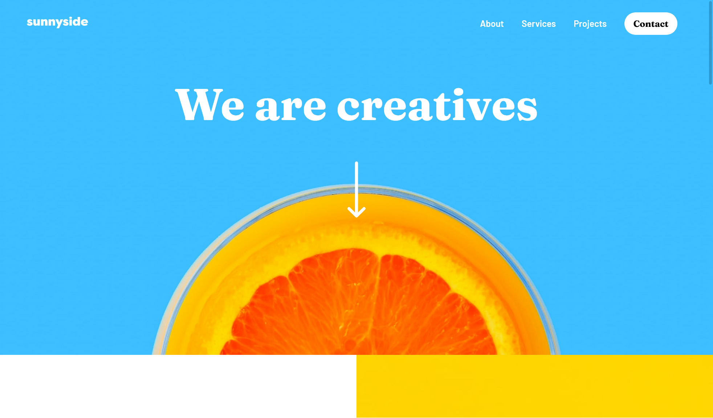

# Frontend Mentor - Sunnyside agency landing page solution

This is a solution to the [Sunnyside agency landing page challenge on Frontend Mentor](https://www.frontendmentor.io/challenges/sunnyside-agency-landing-page-7yVs3B6ef). Frontend Mentor challenges help you improve your coding skills by building realistic projects.

## Table of contents

- [Overview](#overview)
  - [The challenge](#the-challenge)
  - [Screenshot](#screenshot)
  - [Links](#links)
- [My process](#my-process)
  - [Built with](#built-with)
  - [What I learned](#what-i-learned)
  - [Continued development](#continued-development)
- [Author](#author)
## Overview

### The challenge

Users should be able to:

- View the optimal layout for the site depending on their device's screen size

### Screenshot



### Links

- Live Site URL: [live site URL here](https://alexvillhen.github.io/sunnyside/)

## My process

### Built with

- Semantic HTML5 markup
- CSS custom properties
- Flexbox
- CSS Grid
- JS

### What I learned

This is the first time I use JS in a project(for the responsive menu) and it was kinda challenging but at the end,  I'm happy with the result

```html
<nav>
    <div class="logo">
      
    </div>

    <ul class="menu">
      <li class="menu__element"><a class="menu__link" href="#">About</a></li>
      <li class="menu__element"><a class="menu__link" href="#">Services</a></li>
      <li class="menu__element"><a class="menu__link" href="#">Projects</a></li>
      <li class="menu__element-contact"><a class="menu__link-contact" href="#">Contact</a></li>
    </ul>
    
    <div class="ham-button" id="menuButton">
      <div class="ham-row" id="rowTop"></div>
      <div class="ham-row" id="rowMid"></div>
      <div class="ham-row" id="rowBot"></div>
    </div>

    <ul class="responsive-menu" id="responsiveMenu">
      <li class="responsive-menu__element"><a class="responsive-menu__link" href="#">About</a></li>
      <li class="responsive-menu__element"><a class="responsive-menu__link" href="#">Services</a></li>
      <li class="responsive-menu__element"><a class="responsive-menu__link" href="#">Projects</a></li>
      <li class="responsive-menu__element-contact"><a class="responsive-menu__link-contact" href="#">Contact</a></li>
    </ul>

  </nav>
```

```css
.responsive-menu{
    display: flex;
    flex-direction: column;
    padding:0;
    list-style:none;
    background-color: #fff;
    padding:0em 4em;
    position:absolute;
    top:-500px;;
    right: 50px; 
    transition-property: top;
    transition-duration: 400ms;
}
```

```js
function toggleMenu() {
    if(menuOn == false){
        menu.style.top = "45px";
        rowMid.style.right = "-150px";
        rowTop.style.transform = "rotate(45deg)";
        rowTop.style.top = "11.5px";
        rowBot.style.transform = "rotate(-45deg)";
        rowBot.style.bottom = "11.5px";
        menuOn = true;

        
    } 
    else{
        menu.style.top = "-500px";
        rowMid.style.right = "0px";
        rowTop.style.transform = "rotate(0deg)";
        rowTop.style.top = "0px";
        rowBot.style.transform = "rotate(0deg)";
        rowBot.style.bottom = "0px";
        menuOn = false;
    }
}
```

### Continued development

This is my first project with JS, I have to keep improving my programming skills and how I make my responsive menus.
## Author

- Frontend Mentor - [@alexvillhen](https://www.frontendmentor.io/profile/alexvillhen)
- Twitter - [@alexvillhen](https://www.twitter.com/alexvillhen)